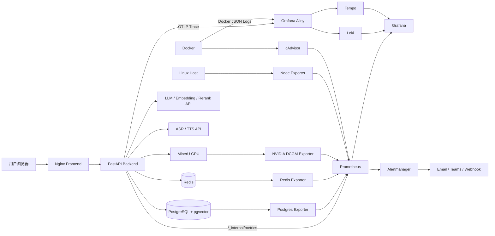

# HRagent-05 生产环境监控可视化落地方案

> 适用项目：HRagent-05（FastAPI + LangChain/LangGraph + PostgreSQL/pgvector + Redis + MinerU GPU + 外部 LLM/Embedding/Rerank + Nginx + Docker Compose）  
> 文档版本：1.0  
> 生成日期：2026-07-10

---

## 1. 最终结论

### 1.1 推荐主方案

本项目最适合采用以下自托管开源可观测性体系：

```text
Grafana OSS
+ Prometheus
+ Alertmanager
+ Grafana Loki
+ Grafana Tempo
+ Grafana Alloy
+ OpenTelemetry
+ cAdvisor / Node Exporter
+ PostgreSQL Exporter / Redis Exporter
+ NVIDIA DCGM Exporter
```

该方案覆盖：

- FastAPI 接口的 RPS、错误率、P50/P95/P99；
- SSE 流式接口的首包时间 TTFT 和完整流耗时；
- LLM、Embedding、Rerank、RAG、Agent 工作流分阶段耗时；
- LLM 超时、重试、限流和本地 fallback；
- PostgreSQL、pgvector、Redis、MinerU、GPU、Docker 和宿主机；
- 日志、指标、Trace 三者关联；
- Grafana Dashboard 和告警通知。

### 1.2 为什么不把 ELK 作为本项目首选

ELK 可以使用，但不是当前 HRagent-05 的最优首选，原因如下：

| 对比项 | Grafana 可观测性栈 | ELK / Elastic Stack |
|---|---|---|
| 核心优势 | 指标、日志、Trace 联合分析 | 全文日志检索、日志分析 |
| FastAPI 指标 | Prometheus 原生适配 | 需要 Metricbeat/APM 或自行转换 |
| LLM/SSE 延迟监控 | Histogram、Trace、Exemplar 更直接 | APM 可实现，但体系更重 |
| Docker/Redis/PostgreSQL/GPU | Exporter 生态成熟 | 需要多个 Agent/Integration |
| 初始资源开销 | 相对较低 | Elasticsearch 和 Logstash 开销较高 |
| 当前项目匹配度 | 高 | 中等偏高 |
| 运维复杂度 | 中 | 中高 |
| 日志全文搜索 | 中高 | 高 |

因此，本方案采用：

```text
Prometheus 负责指标
Loki 负责日志
Tempo 负责 Trace
Grafana 负责统一 Dashboard
Alloy 负责采集和转发
```

如果公司已经存在统一 Elastic 平台，可以将 HRagent 的 JSON 日志额外转发到 Elastic；但不建议在本项目服务器上再单独部署一套完整 ELK。

---

## 2. 项目现状分析

## 2.1 当前运行组件

根据项目代码和 Docker Compose，当前系统包含：

| 组件 | 技术 | 当前端口/调用方式 | 监控重点 |
|---|---|---|---|
| Frontend | Vite + Nginx | 8080 / 8443 | 代理错误、SSE 断开、请求量 |
| Backend | FastAPI + Uvicorn | 8111 | 延迟、错误、并发、Worker、业务成功率 |
| Agent | LangChain + LangGraph | Backend 内部 | Node 耗时、异常、fallback |
| LLM | 外部 HTTP API | `httpx` | TTFT、总耗时、Token、429、超时 |
| Embedding | 外部 HTTP API | `httpx` | 批次数量、耗时、异常 |
| Rerank | 外部 HTTP API | `httpx` | 请求数、候选数、耗时 |
| PostgreSQL | PostgreSQL 16 + pgvector | 5432 | 连接、慢查询、锁、向量查询 |
| Redis | Redis 7 | 容器内 6379 | 命中率、内存、淘汰、连接 |
| MinerU | GPU 容器 | 容器内 8000 | 任务耗时、排队、GPU、失败 |
| ASR | HTTP + WebSocket | 外部 API | 连接、音频时长、断流、延迟 |
| TTS | 外部 API + Redis 缓存 | 外部 API | 缓存、耗时、错误 |
| Auth | PostgreSQL + Redis | Backend 内部 | 登录失败、限流、Session |

## 2.2 当前监控缺口

### 后端缺口

1. `/api/v1/health` 仅返回静态 `status=ok`，没有检测 PostgreSQL、Redis 和 MinerU；
2. 没有 Prometheus `/metrics`；
3. 没有统一 Trace；
4. 日志为普通文本，不是结构化 JSON；
5. 部分模块使用自定义 `get_logger()`，部分直接使用 `logging.getLogger()`，日志格式不统一；
6. 日志中没有统一的 `request_id`、`trace_id` 和业务阶段；
7. HTTP 200 不能代表 LLM 真正成功，因为 Employee、Guidance 和 Coach 存在本地 fallback；
8. SSE 接口未分别监控响应头时间、TTFT、流完成时间和客户端中断；
9. 当前配置含 `WEB_CONCURRENCY=4`，但原始 Uvicorn 启动命令没有传入 `--workers`，需要上线前确认实际 Worker 数；
10. 原始 `PostgresRepository` 每次通过 `psycopg.connect()` 创建连接，且初始化时执行 Schema 检查；连接池监控必须在 P0 性能修复后接入。

### 基于压力测试的重点

当前压测中最需要监控的接口为：

| 接口 | Average | P95 | P99 | 监控优先级 |
|---|---:|---:|---:|---|
| `POST /api/v1/rehearsal/{session}/message` | 约 9.56 秒 | 18 秒 | 32 秒 | P0 |
| `POST /api/v1/reports/{session}/coach` | 约 12.85 秒 | 17 秒 | 19 秒 | P0 |
| `GET /api/v1/sessions/{session}` | 约 124 ms | 500 ms | 980 ms | P1 |
| `POST /api/v1/rehearsal/{session}/end` | 约 186 ms | 550 ms | 910 ms | P1 |

Locust 显示 `Failures=0`，但项目代码可能在模型失败时返回本地结果。因此生产监控必须区分：

```text
HTTP 成功
LLM 成功
LLM 超时后 fallback
RAG 失败后降级
Coach 部分成功
完整业务成功
```

---

## 3. 监控目标和 SLO

## 3.1 建议 SLO

上线初期建议采用分级 SLO，而不是把普通 API 和 LLM 接口混成一个指标。

| 类别 | 指标 | 初期目标 | 稳定期目标 |
|---|---|---:|---:|
| 可用性 | Backend 月可用性 | ≥ 99.5% | ≥ 99.9% |
| 普通 API | P95 | < 500 ms | < 300 ms |
| 普通 API | 5xx 比例 | < 1% | < 0.5% |
| Session 查询 | P95 | < 500 ms | < 250 ms |
| Employee SSE | TTFT P95 | < 3 秒 | < 2 秒 |
| Employee SSE | 完整耗时 P95 | < 10 秒 | < 6 秒 |
| Guidance SSE | TTFT P95 | < 3 秒 | < 2 秒 |
| Coach 热缓存 | P95 | < 800 ms | < 500 ms |
| Coach 冷生成 | P95 | < 15 秒 | < 10 秒或改异步 |
| LLM | Timeout 比例 | < 3% | < 1% |
| LLM | Fallback 比例 | < 5% | < 2% |
| Redis | 缓存命中率 | > 60% | > 75% |
| PostgreSQL | 连接池占用率 | < 80% | < 70% |
| MinerU | 文档解析成功率 | > 95% | > 98% |

## 3.2 四个黄金信号

每个核心服务必须覆盖：

1. **Latency**：P50、P95、P99、TTFT、完整流耗时；
2. **Traffic**：RPS、并发请求、LLM 调用量、文档解析量；
3. **Errors**：HTTP 错误、业务失败、超时、fallback、Trace 异常；
4. **Saturation**：CPU、内存、数据库连接池、Redis 内存、GPU、并发信号量和队列。

---

## 4. 总体架构



## 4.1 数据流

```text
Metrics：Backend/Exporter → Prometheus → Grafana/Alertmanager
Logs：Docker stdout → Alloy → Loki → Grafana
Traces：FastAPI OpenTelemetry → Alloy OTLP → Tempo → Grafana
```

## 4.2 部署方式

推荐把监控组件放到独立服务器：

```text
业务服务器：frontend、backend、postgres、redis、mineru
监控服务器：grafana、prometheus、alertmanager、loki、tempo
采集组件：alloy、node-exporter、cadvisor、dcgm-exporter
```

小规模 POC 可部署在同一台服务器，但 MinerU 已使用 GPU 和较大共享内存，正式环境不建议让 Loki、Tempo、Prometheus 与 MinerU 抢占磁盘和内存。

---

## 5. 组件选型

| 组件 | 作用 | 是否必须 | 建议部署位置 |
|---|---|---|---|
| Grafana OSS | Dashboard、关联查询 | 必须 | 监控服务器 |
| Prometheus | 指标存储和 PromQL | 必须 | 监控服务器 |
| Alertmanager | 告警路由、聚合、静默 | 必须 | 监控服务器 |
| Grafana Alloy | Docker 日志和 OTLP 收集 | 必须 | 业务服务器 |
| Loki | 日志存储和 LogQL | 必须 | 监控服务器 |
| Tempo | Trace 存储和 TraceQL | 推荐 | 监控服务器 |
| Node Exporter | 宿主机 CPU、内存、磁盘 | 必须 | 业务服务器 |
| cAdvisor | Docker 容器资源 | 必须 | 业务服务器 |
| Postgres Exporter | PostgreSQL 指标 | 必须 | 业务或监控服务器 |
| Redis Exporter | Redis 指标 | 必须 | 业务或监控服务器 |
| DCGM Exporter | NVIDIA GPU 指标 | 必须 | GPU 业务服务器 |
| Blackbox Exporter | HTTP/TCP 外部探测 | 推荐 | 独立监控服务器 |
| Uptime Kuma | 简单状态页 | 可选 | 独立监控服务器 |

### 5.1 软件费用和许可

上述组件可以自托管使用，不需要购买 SaaS 订阅。需要承担服务器、磁盘、备份和运维成本。Grafana、Loki、Tempo 的核心开源项目采用 AGPLv3；公司内部部署通常可行，但仍应按公司开源软件流程登记。

---

## 6. 项目目录设计

建议在项目根目录新增：

```text
HRagent-05/
├── backend/
│   └── observability/
│       ├── __init__.py
│       ├── metrics.py
│       ├── middleware.py
│       ├── tracing.py
│       ├── logging_config.py
│       └── privacy.py
├── monitoring/
│   ├── docker-compose.monitoring.yml
│   ├── .env.monitoring.example
│   ├── prometheus/
│   │   ├── prometheus.yml
│   │   └── rules/
│   │       ├── hragent-alerts.yml
│   │       └── infrastructure-alerts.yml
│   ├── alertmanager/
│   │   └── alertmanager.yml
│   ├── alloy/
│   │   └── config.alloy
│   ├── loki/
│   │   └── loki.yml
│   ├── tempo/
│   │   └── tempo.yml
│   ├── grafana/
│   │   ├── provisioning/
│   │   │   ├── datasources/datasources.yml
│   │   │   └── dashboards/dashboards.yml
│   │   └── dashboards/
│   │       ├── hragent-overview.json
│   │       ├── hragent-api-sse.json
│   │       ├── hragent-llm-rag.json
│   │       ├── hragent-postgres-redis.json
│   │       └── hragent-mineru-gpu.json
│   └── blackbox/
│       └── blackbox.yml
└── scripts/
    ├── start_monitoring.sh
    ├── stop_monitoring.sh
    └── verify_monitoring.sh
```

---

## 7. 后端代码改造

## 7.1 新增依赖

在 `backend/requirements.txt` 增加：

```text
prometheus-client>=0.21
python-json-logger>=3.0
opentelemetry-api>=1.30
opentelemetry-sdk>=1.30
opentelemetry-exporter-otlp-proto-grpc>=1.30
opentelemetry-instrumentation-fastapi>=0.51b0
opentelemetry-instrumentation-httpx>=0.51b0
opentelemetry-instrumentation-psycopg>=0.51b0
opentelemetry-instrumentation-redis>=0.51b0
```

生产环境必须把版本固定到公司制品库中验证过的版本，不要长期使用无限制的 `>=`。

## 7.2 新增配置

在 `backend/config/settings.py` 增加：

```python
observability_enabled: bool = True
metrics_enabled: bool = True
metrics_path: str = "/_internal/metrics"
json_logging_enabled: bool = True
log_level: str = "INFO"

otel_enabled: bool = True
otel_service_name: str = "hragent-backend"
otel_exporter_otlp_endpoint: str = "http://alloy:4317"
otel_trace_sample_ratio: float = 0.10

environment: str = "production"
release_version: str = "0.5.0"
privacy_hash_secret: str = ""
```

对应环境变量：

```env
OBSERVABILITY_ENABLED=true
METRICS_ENABLED=true
METRICS_PATH=/_internal/metrics
JSON_LOGGING_ENABLED=true
LOG_LEVEL=INFO

OTEL_ENABLED=true
OTEL_SERVICE_NAME=hragent-backend
OTEL_EXPORTER_OTLP_ENDPOINT=http://alloy:4317
OTEL_TRACE_SAMPLE_RATIO=0.10

ENVIRONMENT=production
RELEASE_VERSION=0.5.0
PRIVACY_HASH_SECRET=<使用 Docker Secret 注入>
```

## 7.3 Prometheus 指标定义

创建 `backend/observability/metrics.py`：

```python
from prometheus_client import Counter, Gauge, Histogram

HTTP_REQUESTS = Counter(
    "hragent_http_requests_total",
    "HTTP requests",
    ["method", "route", "status_class"],
)

HTTP_DURATION = Histogram(
    "hragent_http_request_duration_seconds",
    "HTTP request duration",
    ["method", "route"],
    buckets=(0.01, 0.025, 0.05, 0.1, 0.25, 0.5, 1, 2, 5, 10, 20, 40, 60),
)

HTTP_INPROGRESS = Gauge(
    "hragent_http_inprogress_requests",
    "In-progress HTTP requests",
    ["method"],
    multiprocess_mode="livesum",
)

SSE_TTFT = Histogram(
    "hragent_sse_ttft_seconds",
    "Time to first SSE business event",
    ["stream", "outcome"],
    buckets=(0.1, 0.25, 0.5, 1, 2, 3, 5, 8, 15, 30),
)

SSE_DURATION = Histogram(
    "hragent_sse_duration_seconds",
    "Full SSE stream duration",
    ["stream", "outcome"],
    buckets=(0.5, 1, 2, 3, 5, 8, 10, 15, 20, 30, 60, 120),
)

SSE_DISCONNECTS = Counter(
    "hragent_sse_disconnects_total",
    "SSE client disconnects",
    ["stream"],
)

LLM_REQUESTS = Counter(
    "hragent_llm_requests_total",
    "LLM requests",
    ["task", "provider", "model", "outcome"],
)

LLM_DURATION = Histogram(
    "hragent_llm_duration_seconds",
    "LLM end-to-end duration",
    ["task", "provider", "model"],
    buckets=(0.25, 0.5, 1, 2, 3, 5, 8, 10, 15, 20, 30, 60),
)

LLM_TTFT = Histogram(
    "hragent_llm_ttft_seconds",
    "LLM time to first token",
    ["task", "provider", "model"],
    buckets=(0.1, 0.25, 0.5, 1, 2, 3, 5, 8, 15),
)

LLM_TOKENS = Counter(
    "hragent_llm_tokens_total",
    "LLM token usage",
    ["task", "model", "direction"],
)

LLM_FALLBACKS = Counter(
    "hragent_llm_fallback_total",
    "LLM fallbacks",
    ["task", "reason"],
)

AGENT_TASK_DURATION = Histogram(
    "hragent_agent_task_duration_seconds",
    "Agent and workflow stage duration",
    ["agent", "task", "outcome"],
    buckets=(0.05, 0.1, 0.25, 0.5, 1, 2, 5, 10, 20, 40),
)

RAG_STAGE_DURATION = Histogram(
    "hragent_rag_stage_duration_seconds",
    "RAG stage duration",
    ["task", "stage", "outcome"],
    buckets=(0.01, 0.025, 0.05, 0.1, 0.25, 0.5, 1, 2, 5, 10),
)

RAG_RESULT_COUNT = Histogram(
    "hragent_rag_result_count",
    "RAG returned chunk count",
    ["task"],
    buckets=(0, 1, 2, 3, 5, 8, 10, 20, 50),
)

CACHE_OPERATIONS = Counter(
    "hragent_cache_operations_total",
    "Redis cache operations",
    ["cache", "operation", "result"],
)

DB_POOL_CONNECTIONS = Gauge(
    "hragent_db_pool_connections",
    "Application database pool connections",
    ["state"],
    multiprocess_mode="livesum",
)

DB_POOL_WAITERS = Gauge(
    "hragent_db_pool_waiters",
    "Application database pool waiters",
    multiprocess_mode="livesum",
)

DB_ACQUIRE_DURATION = Histogram(
    "hragent_db_acquire_duration_seconds",
    "Database connection acquisition duration",
    buckets=(0.001, 0.005, 0.01, 0.025, 0.05, 0.1, 0.25, 0.5, 1, 2),
)

MINERU_JOBS = Counter(
    "hragent_mineru_jobs_total",
    "MinerU jobs",
    ["outcome"],
)

MINERU_DURATION = Histogram(
    "hragent_mineru_duration_seconds",
    "MinerU document parsing duration",
    ["outcome"],
    buckets=(1, 5, 10, 30, 60, 120, 300, 600, 1200, 1800),
)

BUSINESS_RESULTS = Counter(
    "hragent_business_results_total",
    "Business operation results",
    ["operation", "mode", "outcome"],
)
```

### 标签规范

允许作为 Label：

```text
route、method、status_class、task、agent、stage、provider、model、outcome
```

禁止作为 Label：

```text
session_id、user_id、email、request_id、trace_id、document_id、完整 URL、异常全文
```

否则会产生高基数时间序列，导致 Prometheus 和 Loki 性能恶化。

## 7.4 FastAPI 请求中间件

创建 `backend/observability/middleware.py`：

```python
from __future__ import annotations

import time
import uuid

from fastapi import Request
from starlette.middleware.base import BaseHTTPMiddleware

from backend.observability.metrics import (
    HTTP_DURATION,
    HTTP_INPROGRESS,
    HTTP_REQUESTS,
)


class MetricsMiddleware(BaseHTTPMiddleware):
    async def dispatch(self, request: Request, call_next):
        method = request.method
        request_id = request.headers.get("x-request-id") or uuid.uuid4().hex
        request.state.request_id = request_id

        HTTP_INPROGRESS.labels(method=method).inc()
        started = time.perf_counter()
        status_code = 500

        try:
            response = await call_next(request)
            status_code = response.status_code
            response.headers["X-Request-ID"] = request_id
            return response
        finally:
            elapsed = time.perf_counter() - started
            route_obj = request.scope.get("route")
            route = getattr(route_obj, "path", "unmatched")
            status_class = f"{status_code // 100}xx"

            HTTP_REQUESTS.labels(
                method=method,
                route=route,
                status_class=status_class,
            ).inc()
            HTTP_DURATION.labels(method=method, route=route).observe(elapsed)
            HTTP_INPROGRESS.labels(method=method).dec()
```

注意：必须使用 FastAPI 模板路由，例如 `/sessions/{session_id}`，不能直接把真实路径作为 Label。

## 7.5 Metrics Endpoint 和多 Worker

当前项目配置了 `WEB_CONCURRENCY=4`。如果上线时使用多进程 Worker，需要启用 Prometheus Python Client 的 multiprocess mode。

在容器启动前设置：

```bash
export PROMETHEUS_MULTIPROC_DIR=/tmp/prometheus_multiproc
rm -rf "$PROMETHEUS_MULTIPROC_DIR"
mkdir -p "$PROMETHEUS_MULTIPROC_DIR"
```

创建内部 Metrics 路由：

```python
import os

from fastapi import APIRouter, Response
from prometheus_client import (
    CONTENT_TYPE_LATEST,
    CollectorRegistry,
    REGISTRY,
    generate_latest,
    multiprocess,
)

router = APIRouter(include_in_schema=False)


@router.get("/_internal/metrics")
def metrics() -> Response:
    if os.getenv("PROMETHEUS_MULTIPROC_DIR"):
        registry = CollectorRegistry()
        multiprocess.MultiProcessCollector(registry)
    else:
        registry = REGISTRY

    return Response(
        generate_latest(registry),
        media_type=CONTENT_TYPE_LATEST,
    )
```

启动命令建议调整为：

```bash
sh -c '
set -e
export PROMETHEUS_MULTIPROC_DIR=/tmp/prometheus_multiproc
rm -rf "$PROMETHEUS_MULTIPROC_DIR"
mkdir -p "$PROMETHEUS_MULTIPROC_DIR"
exec uvicorn backend.main:app \
  --host 0.0.0.0 \
  --port 8111 \
  --workers "${WEB_CONCURRENCY:-4}" \
  --limit-concurrency "${UVICORN_LIMIT_CONCURRENCY:-50}"
'
```

`/_internal/metrics` 不应通过前端 Nginx 暴露给普通用户，只允许 Prometheus 所在网络访问。

## 7.6 OpenTelemetry Trace

创建 `backend/observability/tracing.py`：

```python
from opentelemetry import trace
from opentelemetry.exporter.otlp.proto.grpc.trace_exporter import OTLPSpanExporter
from opentelemetry.instrumentation.fastapi import FastAPIInstrumentor
from opentelemetry.instrumentation.httpx import HTTPXClientInstrumentor
from opentelemetry.instrumentation.psycopg import PsycopgInstrumentor
from opentelemetry.instrumentation.redis import RedisInstrumentor
from opentelemetry.sdk.resources import Resource
from opentelemetry.sdk.trace import TracerProvider
from opentelemetry.sdk.trace.export import BatchSpanProcessor
from opentelemetry.sdk.trace.sampling import ParentBased, TraceIdRatioBased


def setup_tracing(app, settings) -> None:
    if not settings.otel_enabled:
        return

    resource = Resource.create(
        {
            "service.name": settings.otel_service_name,
            "service.version": settings.release_version,
            "deployment.environment.name": settings.environment,
        }
    )

    provider = TracerProvider(
        resource=resource,
        sampler=ParentBased(TraceIdRatioBased(settings.otel_trace_sample_ratio)),
    )
    provider.add_span_processor(
        BatchSpanProcessor(
            OTLPSpanExporter(
                endpoint=settings.otel_exporter_otlp_endpoint,
                insecure=True,
            )
        )
    )
    trace.set_tracer_provider(provider)

    FastAPIInstrumentor.instrument_app(app, excluded_urls="/_internal/metrics,/api/v1/health/live")
    HTTPXClientInstrumentor().instrument()
    PsycopgInstrumentor().instrument()
    RedisInstrumentor().instrument()
```

### 手工 Span

自动埋点不能识别 Agent 业务阶段，需要在关键代码中手工创建 Span：

```python
from opentelemetry import trace

tracer = trace.get_tracer(__name__)

with tracer.start_as_current_span("agent.employee.reply") as span:
    span.set_attribute("gen_ai.operation.name", "chat")
    span.set_attribute("hragent.task", "employee")
    span.set_attribute("hragent.input_chars", len(prompt_text))
    # 禁止写入 prompt_text 和员工原文
    result = await agent.reply(...)
```

推荐 Span 名称：

```text
agent.profile.extract
agent.intent.recognize
agent.guidance.generate
agent.employee.reply
agent.coach.rubric
agent.coach.emotion
agent.coach.performance
agent.coach.redline
agent.coach.report
rag.render_query
rag.embedding
rag.pgvector_search
rag.rerank
cache.get
cache.set
mineru.parse
asr.transcribe
tts.synthesize
```

## 7.7 JSON 日志和 Trace 关联

当前 `backend/utils/logger.py` 使用普通文本格式。建议改为统一 `logging.config.dictConfig`，所有模块都通过根 Logger 输出 JSON。

日志字段建议：

```json
{
  "timestamp": "2026-07-10T08:00:00.000Z",
  "level": "INFO",
  "service": "hragent-backend",
  "environment": "production",
  "event": "llm.call.completed",
  "request_id": "...",
  "trace_id": "...",
  "span_id": "...",
  "route": "/api/v1/rehearsal/{session_id}/message/stream",
  "task": "employee",
  "model": "deepseek-v4-pro",
  "duration_ms": 1850,
  "outcome": "success",
  "fallback_used": false
}
```

禁止写入：

```text
Authorization、Cookie、API Key、密码、邮箱、员工姓名、Prompt、完整回复、文档正文、音频正文
```

### 隐私哈希

需要关联 Session 时，使用 HMAC，而不是直接保存原始 ID：

```python
import hashlib
import hmac


def privacy_hash(value: str, secret: str) -> str:
    return hmac.new(
        secret.encode("utf-8"),
        value.encode("utf-8"),
        hashlib.sha256,
    ).hexdigest()[:16]
```

Loki Label 仅保留：

```text
service、environment、level、container、component
```

`trace_id`、`request_id` 和哈希 Session ID 只作为 JSON 字段，不作为 Loki Label。

---

## 8. 各业务模块埋点位置

| 文件 | 埋点内容 | 关键指标/Span |
|---|---|---|
| `backend/main.py` | 中间件、Tracing、启动关闭 | HTTP、Worker、启动失败 |
| `backend/api/routes/rehearsal.py` | SSE 生命周期 | TTFT、Total、Disconnect |
| `backend/api/routes/guidance.py` | SSE 生命周期 | TTFT、Total、Cache |
| `backend/services/langchain_llm_service.py` | 同步/异步/流式 LLM | Duration、TTFT、Token、Retry |
| `backend/services/embedding_service.py` | Embedding API | Batch、Duration、Error |
| `backend/services/rerank_service.py` | Rerank API | Candidate count、Duration |
| `backend/services/retrieval_service.py` | RAG 流程 | Query count、Scope、Empty result |
| `backend/vectorstore/pgvector_client.py` | 向量 SQL | Search duration、Top K |
| `backend/services/cache_service.py` | Redis 缓存 | Hit、Miss、Write、Error |
| `backend/services/coach_service.py` | Coach 总流程 | Cache hit、Cold/Hot、Partial |
| `backend/agents/coach_agent/*` | 子评估模块 | Task duration、Fallback |
| `backend/agents/employee_agent.py` | 员工回复 | LLM/Fallback/Mixed |
| `backend/parsers/mineru.py` | 文档解析 | Job duration、Timeout、Size |
| `backend/api/routes/asr.py` | HTTP/WS ASR | Session duration、Disconnect |
| `backend/services/tts_service.py` | TTS 和缓存 | Hit、Duration、Audio bytes |
| `backend/core/auth_dependency.py` | 认证 | Unauthorized、Session lookup |
| `backend/services/rate_limit_service.py` | 限流 | Allowed、Rejected、Redis error |

## 8.1 LLM 调用埋点示例

```python
import time

from backend.observability.metrics import (
    LLM_DURATION,
    LLM_REQUESTS,
    LLM_TOKENS,
)

started = time.perf_counter()
outcome = "error"

try:
    response = await client.post(...)
    response.raise_for_status()
    result = response.json()
    outcome = "success"

    usage = result.get("usage") or {}
    LLM_TOKENS.labels(task=task, model=model, direction="input").inc(
        int(usage.get("prompt_tokens") or 0)
    )
    LLM_TOKENS.labels(task=task, model=model, direction="output").inc(
        int(usage.get("completion_tokens") or 0)
    )
    return result
except TimeoutError:
    outcome = "timeout"
    raise
except Exception:
    outcome = "error"
    raise
finally:
    elapsed = time.perf_counter() - started
    LLM_REQUESTS.labels(
        task=task,
        provider=provider,
        model=model,
        outcome=outcome,
    ).inc()
    LLM_DURATION.labels(
        task=task,
        provider=provider,
        model=model,
    ).observe(elapsed)
```

## 8.2 SSE TTFT 埋点

```python
import time

from backend.observability.metrics import SSE_DURATION, SSE_TTFT

started = time.perf_counter()
first_event_seen = False
outcome = "success"

try:
    async for event in service.stream_manager_message(...):
        if not first_event_seen and event.get("event") in {"thinking", "content", "message"}:
            SSE_TTFT.labels(stream="rehearsal", outcome="success").observe(
                time.perf_counter() - started
            )
            first_event_seen = True
        yield _sse(event)
except Exception:
    outcome = "error"
    raise
finally:
    SSE_DURATION.labels(stream="rehearsal", outcome=outcome).observe(
        time.perf_counter() - started
    )
```

## 8.3 Fallback 监控

在以下位置增加明确计数：

```text
EmployeeAgent 本地话术
Guidance 本地规则
Coach 子任务本地评估
Coach 最终报告 fallback
RAG 检索超时后无知识库继续生成
Redis 异常后无缓存继续执行
```

示例：

```python
LLM_FALLBACKS.labels(
    task="employee",
    reason="timeout",
).inc()

BUSINESS_RESULTS.labels(
    operation="rehearsal_message",
    mode="fallback",
    outcome="success",
).inc()
```

HTTP 200 与业务降级必须分开展示。

---

## 9. 健康检查改造

建议拆成三个端点：

```text
/api/v1/health/live   进程是否存活
/api/v1/health/ready  是否可接收业务流量
/api/v1/health/detail 仅管理员使用的依赖状态
```

### Liveness

仅检查事件循环和进程，不访问外部系统：

```json
{"status":"ok"}
```

### Readiness

并行检测：

- PostgreSQL：`SELECT 1`；
- Redis：`PING`；
- MinerU：`/health`；
- 必要配置是否存在；
- 数据库连接池是否可获取连接。

建议超时：

```text
PostgreSQL 500 ms
Redis 300 ms
MinerU 1 s
总计不超过 1.5 s
```

外部 LLM 不应成为 Readiness 的硬依赖，否则供应商短时抖动会导致整个 Backend 被摘除。LLM 状态单独进入 Dashboard。

---

## 10. Docker Compose 落地

创建 `monitoring/docker-compose.monitoring.yml`：

```yaml
services:
  prometheus:
    image: prom/prometheus:${PROMETHEUS_VERSION:-latest}
    restart: unless-stopped
    command:
      - --config.file=/etc/prometheus/prometheus.yml
      - --storage.tsdb.path=/prometheus
      - --storage.tsdb.retention.time=30d
      - --web.enable-lifecycle
    volumes:
      - ./monitoring/prometheus/prometheus.yml:/etc/prometheus/prometheus.yml:ro
      - ./monitoring/prometheus/rules:/etc/prometheus/rules:ro
      - prometheus_data:/prometheus
    ports:
      - "127.0.0.1:9090:9090"
    depends_on:
      - alertmanager

  alertmanager:
    image: prom/alertmanager:${ALERTMANAGER_VERSION:-latest}
    restart: unless-stopped
    command:
      - --config.file=/etc/alertmanager/alertmanager.yml
    volumes:
      - ./monitoring/alertmanager/alertmanager.yml:/etc/alertmanager/alertmanager.yml:ro
      - alertmanager_data:/alertmanager
    ports:
      - "127.0.0.1:9093:9093"

  grafana:
    image: grafana/grafana-oss:${GRAFANA_VERSION:-latest}
    restart: unless-stopped
    environment:
      GF_SECURITY_ADMIN_USER: ${GRAFANA_ADMIN_USER:-admin}
      GF_SECURITY_ADMIN_PASSWORD: ${GRAFANA_ADMIN_PASSWORD:?required}
      GF_USERS_ALLOW_SIGN_UP: "false"
      GF_AUTH_ANONYMOUS_ENABLED: "false"
    volumes:
      - grafana_data:/var/lib/grafana
      - ./monitoring/grafana/provisioning:/etc/grafana/provisioning:ro
      - ./monitoring/grafana/dashboards:/var/lib/grafana/dashboards:ro
    ports:
      - "127.0.0.1:3000:3000"
    depends_on:
      - prometheus
      - loki
      - tempo

  loki:
    image: grafana/loki:${LOKI_VERSION:-latest}
    restart: unless-stopped
    command: -config.file=/etc/loki/loki.yml
    volumes:
      - ./monitoring/loki/loki.yml:/etc/loki/loki.yml:ro
      - loki_data:/loki
    ports:
      - "127.0.0.1:3100:3100"

  tempo:
    image: grafana/tempo:${TEMPO_VERSION:-latest}
    restart: unless-stopped
    command: -config.file=/etc/tempo/tempo.yml
    volumes:
      - ./monitoring/tempo/tempo.yml:/etc/tempo/tempo.yml:ro
      - tempo_data:/var/tempo
    ports:
      - "127.0.0.1:3200:3200"
    expose:
      - "4317"
      - "4318"

  alloy:
    image: grafana/alloy:${ALLOY_VERSION:-latest}
    restart: unless-stopped
    command:
      - run
      - /etc/alloy/config.alloy
      - --storage.path=/var/lib/alloy/data
    volumes:
      - ./monitoring/alloy/config.alloy:/etc/alloy/config.alloy:ro
      - alloy_data:/var/lib/alloy/data
      - /var/run/docker.sock:/var/run/docker.sock:ro
    ports:
      - "127.0.0.1:12345:12345"
    expose:
      - "4317"
      - "4318"
    depends_on:
      - loki
      - tempo

  node-exporter:
    image: prom/node-exporter:${NODE_EXPORTER_VERSION:-latest}
    restart: unless-stopped
    command:
      - --path.rootfs=/host
    volumes:
      - /:/host:ro,rslave
    expose:
      - "9100"

  cadvisor:
    image: gcr.io/cadvisor/cadvisor:${CADVISOR_VERSION:-latest}
    restart: unless-stopped
    privileged: true
    devices:
      - /dev/kmsg:/dev/kmsg
    volumes:
      - /:/rootfs:ro
      - /var/run:/var/run:ro
      - /sys:/sys:ro
      - /var/lib/docker:/var/lib/docker:ro
      - /dev/disk:/dev/disk:ro
    expose:
      - "8080"

  postgres-exporter:
    image: prometheuscommunity/postgres-exporter:${POSTGRES_EXPORTER_VERSION:-latest}
    restart: unless-stopped
    environment:
      DATA_SOURCE_NAME: ${POSTGRES_EXPORTER_DSN:?required}
    expose:
      - "9187"
    depends_on:
      postgres:
        condition: service_healthy

  redis-exporter:
    image: oliver006/redis_exporter:${REDIS_EXPORTER_VERSION:-latest}
    restart: unless-stopped
    environment:
      REDIS_ADDR: redis://redis:6379
    expose:
      - "9121"
    depends_on:
      redis:
        condition: service_healthy

  dcgm-exporter:
    image: nvcr.io/nvidia/k8s/dcgm-exporter:${DCGM_EXPORTER_VERSION:-latest}
    restart: unless-stopped
    profiles: ["gpu"]
    cap_add:
      - SYS_ADMIN
    deploy:
      resources:
        reservations:
          devices:
            - driver: nvidia
              count: all
              capabilities: [gpu]
    expose:
      - "9400"

  blackbox-exporter:
    image: prom/blackbox-exporter:${BLACKBOX_EXPORTER_VERSION:-latest}
    restart: unless-stopped
    volumes:
      - ./monitoring/blackbox/blackbox.yml:/etc/blackbox_exporter/config.yml:ro
    expose:
      - "9115"

volumes:
  prometheus_data:
  alertmanager_data:
  grafana_data:
  loki_data:
  tempo_data:
  alloy_data:
```

### 10.1 版本管理

POC 可以暂时使用 `latest` 验证，但正式上线必须在 `.env.monitoring` 中固定镜像版本：

```env
PROMETHEUS_VERSION=<approved-version>
ALERTMANAGER_VERSION=<approved-version>
GRAFANA_VERSION=<approved-version>
LOKI_VERSION=<approved-version>
TEMPO_VERSION=<approved-version>
ALLOY_VERSION=<approved-version>
NODE_EXPORTER_VERSION=<approved-version>
CADVISOR_VERSION=<approved-version>
POSTGRES_EXPORTER_VERSION=<approved-version>
REDIS_EXPORTER_VERSION=<approved-version>
DCGM_EXPORTER_VERSION=<approved-version>
BLACKBOX_EXPORTER_VERSION=<approved-version>

GRAFANA_ADMIN_USER=admin
GRAFANA_ADMIN_PASSWORD=<strong-password>
POSTGRES_EXPORTER_DSN=postgresql://monitor_user:<password>@postgres:5432/hr_agent?sslmode=disable
```

不要让 Exporter 使用 PostgreSQL 超级管理员账号，应创建只读监控账号。

---

## 11. Prometheus 配置

`monitoring/prometheus/prometheus.yml`：

```yaml
global:
  scrape_interval: 15s
  evaluation_interval: 15s
  external_labels:
    environment: production
    system: hragent-05

rule_files:
  - /etc/prometheus/rules/*.yml

alerting:
  alertmanagers:
    - static_configs:
        - targets: ["alertmanager:9093"]

scrape_configs:
  - job_name: hragent-backend
    metrics_path: /_internal/metrics
    static_configs:
      - targets: ["backend:8111"]
        labels:
          service: hragent-backend

  - job_name: node
    static_configs:
      - targets: ["node-exporter:9100"]

  - job_name: cadvisor
    static_configs:
      - targets: ["cadvisor:8080"]

  - job_name: postgres
    static_configs:
      - targets: ["postgres-exporter:9187"]

  - job_name: redis
    static_configs:
      - targets: ["redis-exporter:9121"]

  - job_name: nvidia-gpu
    static_configs:
      - targets: ["dcgm-exporter:9400"]

  - job_name: blackbox-http
    metrics_path: /probe
    params:
      module: [http_2xx]
    static_configs:
      - targets:
          - http://backend:8111/api/v1/health/live
          - http://mineru:8000/health
    relabel_configs:
      - source_labels: [__address__]
        target_label: __param_target
      - source_labels: [__param_target]
        target_label: instance
      - target_label: __address__
        replacement: blackbox-exporter:9115
```

---

## 12. Alloy 日志和 Trace 配置

`monitoring/alloy/config.alloy` 示例：

```alloy
logging {
  level = "info"
}

discovery.docker "containers" {
  host = "unix:///var/run/docker.sock"
}

discovery.relabel "containers" {
  targets = discovery.docker.containers.targets

  rule {
    source_labels = ["__meta_docker_container_name"]
    regex         = "/(.*)"
    target_label  = "container"
  }

  rule {
    source_labels = ["__meta_docker_container_label_com_docker_compose_service"]
    target_label  = "service"
  }
}

loki.source.docker "containers" {
  host       = "unix:///var/run/docker.sock"
  targets    = discovery.relabel.containers.output
  forward_to = [loki.process.hragent.receiver]
}

loki.process "hragent" {
  stage.json {
    expressions = {
      level       = "level",
      serviceName = "service",
      traceId     = "trace_id",
      eventName   = "event",
    }
  }

  stage.labels {
    values = {
      level = "",
    }
  }

  forward_to = [loki.write.local.receiver]
}

loki.write "local" {
  endpoint {
    url = "http://loki:3100/loki/api/v1/push"
  }
}

otelcol.receiver.otlp "default" {
  grpc {
    endpoint = "0.0.0.0:4317"
  }

  http {
    endpoint = "0.0.0.0:4318"
  }

  output {
    traces = [otelcol.processor.batch.default.input]
  }
}

otelcol.processor.batch "default" {
  output {
    traces = [otelcol.exporter.otlp.tempo.input]
  }
}

otelcol.exporter.otlp "tempo" {
  client {
    endpoint = "tempo:4317"
    tls {
      insecure = true
    }
  }
}
```

正式部署前执行：

```bash
docker run --rm \
  -v "$PWD/monitoring/alloy/config.alloy:/etc/alloy/config.alloy:ro" \
  grafana/alloy:<approved-version> \
  validate /etc/alloy/config.alloy
```

---

## 13. Loki 与 Tempo 保留策略

### Loki

初期建议：

```text
INFO 日志：14 天
ERROR/WARN 日志：30 天
认证审计日志：按公司安全要求，通常 90 天以上
```

应用日志不保存员工对话和文档正文，因此不能把 Loki 当作业务数据库。

### Tempo

建议：

```text
正常 Trace：采样 10%，保留 7 天
错误 Trace：尽量 100%，保留 14 天
慢请求 Trace：尽量 100%，保留 14 天
```

可以在 Alloy 后续增加 tail sampling：

```text
错误请求全保留
HTTP > 5 秒全保留
LLM > 10 秒全保留
其余请求采样 5%～10%
```

---

## 14. Grafana 数据源配置

`monitoring/grafana/provisioning/datasources/datasources.yml`：

```yaml
apiVersion: 1

datasources:
  - name: Prometheus
    uid: prometheus
    type: prometheus
    access: proxy
    url: http://prometheus:9090
    isDefault: true

  - name: Loki
    uid: loki
    type: loki
    access: proxy
    url: http://loki:3100
    jsonData:
      derivedFields:
        - name: TraceID
          matcherRegex: '"trace_id":"([a-f0-9]+)"'
          datasourceUid: tempo
          url: '$${__value.raw}'

  - name: Tempo
    uid: tempo
    type: tempo
    access: proxy
    url: http://tempo:3200
    jsonData:
      tracesToLogsV2:
        datasourceUid: loki
        spanStartTimeShift: -1m
        spanEndTimeShift: 1m
        filterByTraceID: true
      serviceMap:
        datasourceUid: prometheus
```

---

## 15. Dashboard 设计

## 15.1 Dashboard 1：HRagent 运行总览

第一屏必须在 30 秒内回答：系统是否健康、哪里慢、是否正在降级。

面板：

1. Backend Up；
2. 月可用性；
3. 当前 RPS；
4. 5xx 比例；
5. 普通 API P95；
6. Employee TTFT P95；
7. Employee Total P95；
8. Coach 冷生成 P95；
9. LLM Timeout 比例；
10. Fallback 比例；
11. PostgreSQL 连接池占用；
12. Redis 缓存命中率；
13. MinerU 成功率；
14. GPU 使用率；
15. Backend 容器 CPU/内存；
16. 最近告警和错误日志。

### PromQL 示例

总 RPS：

```promql
sum(rate(hragent_http_requests_total[5m]))
```

接口 P95：

```promql
histogram_quantile(
  0.95,
  sum by (le, method, route) (
    rate(hragent_http_request_duration_seconds_bucket[5m])
  )
)
```

5xx 比例：

```promql
sum(rate(hragent_http_requests_total{status_class="5xx"}[5m]))
/
sum(rate(hragent_http_requests_total[5m]))
```

Fallback 比例：

```promql
sum(rate(hragent_llm_fallback_total[10m]))
/
clamp_min(sum(rate(hragent_llm_requests_total[10m])), 0.001)
```

## 15.2 Dashboard 2：API 与 SSE

面板：

- 每个路由的 RPS；
- P50/P95/P99；
- 4xx/5xx；
- In-flight；
- Top 10 慢接口；
- SSE TTFT；
- SSE 完整流耗时；
- SSE 客户端中断；
- WebSocket ASR 活跃 Session；
- Nginx upstream 错误。

Employee TTFT P95：

```promql
histogram_quantile(
  0.95,
  sum by (le) (
    rate(hragent_sse_ttft_seconds_bucket{stream="rehearsal"}[5m])
  )
)
```

## 15.3 Dashboard 3：LLM、Agent 与 RAG

面板：

- 不同任务 LLM 调用量；
- 模型成功率、超时率和 429；
- LLM P50/P95/P99；
- TTFT；
- 输入/输出 Token；
- fallback 原因分布；
- Agent 各节点耗时；
- Embedding、pgvector、Rerank 分阶段耗时；
- 检索空结果比例；
- Coach 子任务状态；
- Coach `llm/fallback/mixed` 比例。

## 15.4 Dashboard 4：PostgreSQL 与 pgvector

面板：

- 活跃/空闲连接；
- 连接池 in-use/available/waiting；
- 获取连接等待时间；
- 事务提交/回滚；
- 锁等待；
- 死锁；
- 慢查询；
- 数据库大小；
- `kb_chunks` 数量；
- 向量搜索 P95；
- HNSW 索引大小和命中情况。

建议启用 `pg_stat_statements`，但日志和 Dashboard 中不要展示包含员工数据的 SQL 参数。

## 15.5 Dashboard 5：Redis 与缓存

面板：

- Redis Up；
- 已用内存；
- Connected Clients；
- Blocked Clients；
- Evicted Keys；
- Keyspace Hit/Miss；
- Guidance/TTS/Document/Rehearsal/Coach 各缓存命中率；
- Redis Error 后的业务降级次数。

## 15.6 Dashboard 6：MinerU 与 GPU

面板：

- MinerU 请求量和成功率；
- 解析 P50/P95/P99；
- 超时和文件类型；
- 并发任务和排队；
- GPU Utilization；
- GPU Memory；
- GPU Temperature；
- GPU Power；
- XID Error；
- MinerU 容器 CPU/内存/共享内存。

## 15.7 Dashboard 7：日志和 Trace

Loki 查询示例：

错误日志：

```logql
{service="backend"} | json | level="ERROR"
```

Fallback：

```logql
{service="backend"} | json | fallback_used="true"
```

LLM Timeout：

```logql
{service="backend"} | json | event="llm.call.completed" | outcome="timeout"
```

通过 `trace_id` 从日志跳转到 Tempo，查看：

```text
FastAPI → Auth → PostgreSQL → Redis → Embedding → pgvector → Rerank → LLM → SSE
```

---

## 16. 告警规则

创建 `monitoring/prometheus/rules/hragent-alerts.yml`：

```yaml
groups:
  - name: hragent-backend
    rules:
      - alert: HRagentBackendDown
        expr: up{job="hragent-backend"} == 0
        for: 1m
        labels:
          severity: critical
        annotations:
          summary: "HRagent Backend 不可用"

      - alert: HRagentHigh5xxRate
        expr: |
          sum(rate(hragent_http_requests_total{status_class="5xx"}[5m]))
          /
          clamp_min(sum(rate(hragent_http_requests_total[5m])), 0.001)
          > 0.01
        for: 5m
        labels:
          severity: critical
        annotations:
          summary: "HRagent 5xx 比例超过 1%"

      - alert: HRagentNormalApiP95High
        expr: |
          histogram_quantile(
            0.95,
            sum by (le) (
              rate(hragent_http_request_duration_seconds_bucket{
                route!~".*/message.*|.*/stream|.*/coach"
              }[5m])
            )
          ) > 0.5
        for: 10m
        labels:
          severity: warning
        annotations:
          summary: "普通 API P95 超过 500ms"

      - alert: HRagentEmployeeTTFTHigh
        expr: |
          histogram_quantile(
            0.95,
            sum by (le) (
              rate(hragent_sse_ttft_seconds_bucket{stream="rehearsal"}[5m])
            )
          ) > 3
        for: 10m
        labels:
          severity: warning
        annotations:
          summary: "Employee SSE TTFT P95 超过 3 秒"

      - alert: HRagentLLMTimeoutRateHigh
        expr: |
          sum(rate(hragent_llm_requests_total{outcome="timeout"}[10m]))
          /
          clamp_min(sum(rate(hragent_llm_requests_total[10m])), 0.001)
          > 0.03
        for: 10m
        labels:
          severity: critical
        annotations:
          summary: "LLM 超时率超过 3%"

      - alert: HRagentFallbackRateHigh
        expr: |
          sum(rate(hragent_llm_fallback_total[10m]))
          /
          clamp_min(sum(rate(hragent_llm_requests_total[10m])), 0.001)
          > 0.05
        for: 10m
        labels:
          severity: warning
        annotations:
          summary: "LLM fallback 比例超过 5%"

      - alert: HRagentDBPoolWaiting
        expr: hragent_db_pool_waiters > 0
        for: 3m
        labels:
          severity: critical
        annotations:
          summary: "PostgreSQL 连接池持续存在等待"

      - alert: HRagentRedisEvictions
        expr: increase(redis_evicted_keys_total[10m]) > 0
        for: 1m
        labels:
          severity: warning
        annotations:
          summary: "Redis 出现 Key 淘汰"

      - alert: HRagentMineruFailureRateHigh
        expr: |
          sum(rate(hragent_mineru_jobs_total{outcome!="success"}[30m]))
          /
          clamp_min(sum(rate(hragent_mineru_jobs_total[30m])), 0.001)
          > 0.05
        for: 10m
        labels:
          severity: warning
        annotations:
          summary: "MinerU 失败率超过 5%"
```

基础设施告警还应包括：

```text
宿主机磁盘使用率 > 85%
容器内存 > 限额 85%
Backend/PostgreSQL/Redis/MinerU 容器重启
PostgreSQL 连接数 > 80%
Redis 内存 > 80%
GPU 温度过高
GPU XID Error
Prometheus/Loki/Tempo 磁盘空间不足
```

---

## 17. Alertmanager 通知

推荐优先使用公司允许的：

```text
Email
Microsoft Teams Webhook
内部告警平台 Webhook
```

告警路由建议：

| Severity | 行为 |
|---|---|
| critical | 立即通知，5 分钟重复确认 |
| warning | 工作时间通知，30 分钟聚合 |
| info | 仅进入 Dashboard 或日报 |

告警内容必须包含：

```text
服务、环境、告警时间、当前值、阈值、Dashboard 链接、Runbook 链接
```

不要在告警内容中包含员工姓名、邮箱、对话内容或文档内容。

---

## 18. 安全和隐私要求

本项目属于 HR 场景，监控数据需要按敏感业务数据处理。

## 18.1 禁止采集

- 用户密码和密码 Hash；
- Authorization、Cookie、JWT、API Key；
- 员工姓名、邮箱、员工号；
- 完整 Session ID；
- 上传文档正文；
- Prompt 和模型完整输出；
- 绩效报告正文；
- ASR 完整转写；
- 音频内容；
- SQL 参数值。

## 18.2 允许采集

- 模板路由；
- 状态码和异常类别；
- 响应时间；
- Token 数量；
- 输入字符数；
- 检索 Chunk 数；
- 缓存命中；
- 模型名称；
- fallback 标识；
- HMAC 后的关联 ID。

## 18.3 网络安全

生产环境应调整当前 Compose：

1. PostgreSQL 不再使用 `0.0.0.0:5432` 暴露；
2. Redis 不再对外暴露 `6381`；
3. Elasticsearch 或 Prometheus 类后台端口不暴露公网；
4. Grafana 通过公司 Nginx、HTTPS、VPN 或反向代理 SSO 访问；
5. `/_internal/metrics` 只在内部 Docker 网络开放；
6. Grafana 禁止匿名访问；
7. 监控账号采用最小权限；
8. Secret 使用 Docker Secret、Vault 或公司密钥管理，不提交 Git。

---

## 19. 容量和资源建议

## 19.1 小规模生产

假设：

```text
日请求量 < 10 万
日志 < 5 GB/天
Trace 采样 10%
指标保留 30 天
日志保留 14 天
Trace 保留 7 天
```

独立监控服务器建议：

```text
4 vCPU
8 GB RAM
200 GB SSD
```

如果日志超过 10 GB/天或 Trace 量明显上升，建议：

```text
8 vCPU
16 GB RAM
500 GB SSD 或对象存储
```

## 19.2 资源限制

给监控容器设置资源上限，避免影响业务：

```text
Prometheus：1～2 CPU，2～4 GB RAM
Grafana：0.5～1 CPU，512 MB～1 GB RAM
Loki：1～2 CPU，1～4 GB RAM
Tempo：1 CPU，1～2 GB RAM
Alloy：0.5～1 CPU，256～512 MB RAM
```

---

## 20. 实施阶段

## 阶段 0：生产前置修复

必须完成：

- 数据库连接池；
- Schema 初始化移出请求路径；
- HTTP Client 连接复用；
- 服务实例复用；
- 明确 Uvicorn Worker 数；
- 降低 `UVICORN_LIMIT_CONCURRENCY` 到经过压测验证的值；
- Coach 冷生成考虑改为异步任务。

监控不能替代性能修复。

## 阶段 1：基础指标和 Dashboard

工期建议：1～2 天。

任务：

1. 添加 Prometheus Client；
2. 添加 HTTP Middleware；
3. 增加 `/metrics`；
4. 部署 Prometheus、Grafana、Node Exporter、cAdvisor；
5. 接入 PostgreSQL、Redis、GPU Exporter；
6. 创建系统总览 Dashboard。

验收：所有 Prometheus Target 为 `UP`。

## 阶段 2：业务指标和告警

工期建议：2～3 天。

任务：

1. LLM、Embedding、Rerank 指标；
2. SSE TTFT 和完整流指标；
3. fallback 和业务结果指标；
4. RAG 分阶段指标；
5. Redis Cache 指标；
6. MinerU 指标；
7. Alertmanager 告警。

## 阶段 3：日志平台

工期建议：1～2 天。

任务：

1. 全局 JSON 日志；
2. 日志脱敏；
3. Alloy 采集 Docker 日志；
4. Loki 存储；
5. Grafana Logs Dashboard。

## 阶段 4：全链路 Trace

工期建议：2～4 天。

任务：

1. FastAPI、HTTPX、Psycopg、Redis 自动埋点；
2. Agent/RAG/LLM 手工 Span；
3. Alloy OTLP；
4. Tempo；
5. Logs、Metrics、Traces 跳转。

## 阶段 5：压测和阈值校准

工期建议：1～2 天。

执行：

```text
普通 API：10、50、100 并发
LLM 流程：5、10、20、30 并发
冷缓存与热缓存分开
每档至少 10 分钟
重复三轮
```

根据真实数据修正告警阈值，避免上线后告警风暴。

---

## 21. 上线命令

### 21.1 创建分支

```bash
git checkout -b feat/hragent-observability
```

### 21.2 校验 Compose

```bash
docker compose \
  -p hragent \
  -f docker-compose.yml \
  -f monitoring/docker-compose.monitoring.yml \
  config > /tmp/hragent-compose-rendered.yml
```

### 21.3 启动

无 GPU Exporter：

```bash
docker compose \
  -p hragent \
  -f docker-compose.yml \
  -f monitoring/docker-compose.monitoring.yml \
  up -d
```

启用 GPU Exporter：

```bash
docker compose \
  -p hragent \
  -f docker-compose.yml \
  -f monitoring/docker-compose.monitoring.yml \
  --profile gpu \
  up -d
```

### 21.4 验证

```bash
curl -fsS http://127.0.0.1:8111/api/v1/health/live
curl -fsS http://127.0.0.1:8111/api/v1/health/ready
curl -fsS http://127.0.0.1:8111/_internal/metrics | head
curl -fsS http://127.0.0.1:9090/-/ready
curl -fsS http://127.0.0.1:3100/ready
curl -fsS http://127.0.0.1:3200/ready
```

检查 Target：

```text
Prometheus → Status → Targets
```

检查日志：

```text
Grafana → Explore → Loki
```

检查 Trace：

```text
Grafana → Explore → Tempo
```

---

## 22. 验收标准

### 基础设施

- [ ] Prometheus、Grafana、Loki、Tempo、Alloy 正常运行；
- [ ] Backend、PostgreSQL、Redis、Node、Docker、GPU Target 全部为 UP；
- [ ] 监控服务重启后数据卷不丢失；
- [ ] 监控端口未暴露公网；
- [ ] 磁盘保留策略生效。

### 后端

- [ ] 所有 API 有 RPS、状态码和延迟；
- [ ] 路由 Label 不包含真实 Session ID；
- [ ] SSE 有 TTFT、完整耗时和断开指标；
- [ ] LLM 有任务、模型、成功、超时、重试、Token；
- [ ] fallback 可以独立统计；
- [ ] Coach 可以区分热缓存、冷生成和降级；
- [ ] PostgreSQL 连接池等待可见；
- [ ] Redis 缓存命中率可见；
- [ ] MinerU 和 GPU 可见。

### 日志和 Trace

- [ ] 每条请求有 request_id；
- [ ] 日志包含 trace_id；
- [ ] Grafana 可以从日志跳转到 Trace；
- [ ] 慢请求可以定位到 LLM、RAG、DB 或 Redis；
- [ ] 日志不存在 Prompt、员工信息、Token、Cookie 和文档正文。

### 告警

- [ ] Backend Down 告警测试成功；
- [ ] 5xx 告警测试成功；
- [ ] LLM Timeout 和 fallback 告警测试成功；
- [ ] DB Pool Waiting 告警测试成功；
- [ ] 磁盘、Redis、GPU 告警测试成功；
- [ ] 告警包含 Dashboard 和 Runbook 链接。

### 性能开销

- [ ] Metrics/Trace/JSON Logging 对普通接口 P95 增量低于 5%；
- [ ] 日志和 Trace 发送失败不会阻塞业务；
- [ ] Alloy/Loki/Tempo 故障时 Backend 仍可正常提供业务；
- [ ] 没有同步网络日志 Handler。

---

## 23. 回滚方案

后端埋点必须支持环境变量关闭：

```env
OBSERVABILITY_ENABLED=false
METRICS_ENABLED=false
OTEL_ENABLED=false
JSON_LOGGING_ENABLED=false
```

监控组件回滚：

```bash
docker compose \
  -p hragent \
  -f docker-compose.yml \
  -f monitoring/docker-compose.monitoring.yml \
  stop grafana prometheus alertmanager loki tempo alloy
```

保留数据卷，待问题修复后恢复。监控服务故障不能成为业务启动失败的硬依赖。

---

## 24. 最终实施优先级

### P0：上线前必须完成

1. Prometheus + Grafana；
2. FastAPI HTTP 指标；
3. SSE TTFT 和完整流耗时；
4. LLM 成功、超时和 fallback；
5. PostgreSQL、Redis、Docker、GPU；
6. Backend Down、5xx、LLM 超时、磁盘告警；
7. JSON 日志脱敏；
8. `/health/live` 和 `/health/ready`。

### P1：上线后一周内

1. Loki 日志；
2. OpenTelemetry + Tempo；
3. RAG 和 Agent 子任务 Trace；
4. Grafana Metrics/Logs/Traces 关联；
5. SLO Dashboard 和错误预算。

### P2：业务量增长后

1. Loki/Tempo 对象存储；
2. Prometheus Remote Write 或 Mimir；
3. 多实例高可用；
4. Tail Sampling；
5. Pyroscope 连续性能分析；
6. 自动容量预测和日报。

---

## 25. 最终推荐

对于当前 HRagent-05，最符合实际情况的生产监控方案是：

```text
Grafana OSS
+ Prometheus
+ Alertmanager
+ Loki
+ Tempo
+ Alloy
+ OpenTelemetry
+ PostgreSQL/Redis/Docker/GPU Exporter
```

核心原因不是“Dashboard 好看”，而是这套体系能够同时回答：

```text
系统是否存活？
哪个接口正在变慢？
是数据库、Redis、RAG、LLM 还是 GPU 慢？
HTTP 200 是否真的由 LLM 成功生成？
有多少请求已经进入 fallback？
一次 18 秒请求具体慢在哪个 Span？
上线后性能是否比 Locust 基线改善？
```

ELK 可以作为公司既有日志平台的补充出口，但不建议作为本项目唯一或第一监控体系。

---

## 26. 官方参考资料

- Grafana Alloy：<https://grafana.com/docs/alloy/latest/>
- Grafana Loki：<https://grafana.com/docs/loki/latest/>
- Grafana Tempo：<https://grafana.com/docs/tempo/latest/>
- Grafana OSS：<https://grafana.com/oss/grafana/>
- Grafana License：<https://grafana.com/licensing/>
- Prometheus Overview：<https://prometheus.io/docs/introduction/overview/>
- Prometheus Alertmanager：<https://prometheus.io/docs/alerting/latest/overview/>
- Prometheus Python Multiprocess：<https://prometheus.github.io/client_python/multiprocess/>
- OpenTelemetry Python：<https://opentelemetry.io/docs/languages/python/instrumentation/>
- NVIDIA DCGM Exporter：<https://github.com/NVIDIA/dcgm-exporter>

